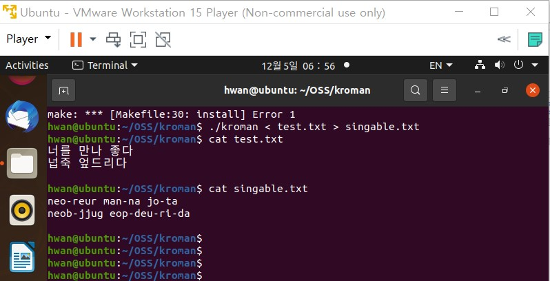

 
제목: kroman 음운 변동 현상 적용
 

 
 

kroman의 로마자 변환은 한글 음절을 초성, 중성, 종성으로 분리한 뒤 이를 대응되는 알파벳 집합으로 대체하는 식입니다.
 
음절 간, 형태소 간의 차이를 보지 않기 때문에 한글의 특성인 음운 변동 현상을 반영하지 않습니다.
 
그래서 저희는 로마자로 변환했을 때에도 보다 자연스러운 발음이 가능토록 변환시키고자 했습니다.
 
추가된 코드 설명은 wiki : <https://github.com/20-2-SKKU-OSS/kroman/wiki>를 참고해주세요.
